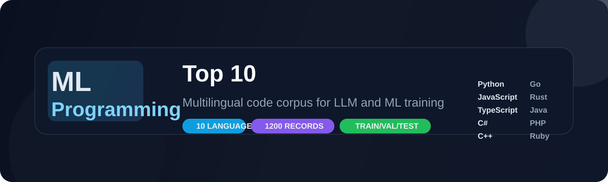

# ML Programming Top 10

<p align="center">
  
</p>

<p align="center">
  
  
  
  
  
</p>

A premium multilingual programming corpus for LLM and ML training, built to support software generation, code understanding, low-level reasoning, and project-scale learning across the world’s most used languages.

This repository is optimized for discovery in searches for: machine learning dataset, LLM training data, multilingual programming dataset, code generation dataset, AI training data, programming benchmark, multilingual code corpus, and assembly and binary dataset.

This repository combines:

- high-level programming examples
- project-style bundling and file layouts
- assembly and binary references for low-level learning
- benchmark-ready train, validation, and test splits
- mixed realistic and synthetic examples for broader training coverage

## Why this corpus matters

The project is designed for models that need to move beyond toy snippets and learn how real software is structured and reasoned about.

It helps train systems to:

- generate working code across major languages
- understand project architecture and folder layouts
- reason about memory, execution, and low-level primitives
- handle assembly and binary concepts without brittle false positives
- work from full project patterns rather than isolated function examples

## Languages included

- Python
- JavaScript
- TypeScript
- Java
- C#
- C++
- Go
- Rust
- PHP
- Ruby

## Built for

This corpus is designed for teams and researchers training models for:

- code generation and synthesis
- multilingual code understanding
- project-level software planning
- systems thinking and low-level reasoning
- benchmark creation and evaluation

## What makes it different

| Capability | Included |
| --- | --- |
| Multilingual coverage | 10 major languages |
| Project structure learning | Yes |
| Assembly and binary context | Yes |
| Benchmark-ready splits | Train / validation / test |
| Realistic + synthetic mix | Yes |
| Cross-language reasoning | Yes |

## Typical training use cases

- training code models to write complete programs
- evaluating multilingual reasoning quality
- teaching low-level concepts like memory and execution
- building project and file-layout understanding
- preparing robust benchmark pipelines for code LLMs

## Dataset suites

### Core corpus
A foundational mixed-language dataset covering core programming tasks and realistic software patterns.

### Low-level training corpus
Includes low-level material focused on:

- memory behavior
- syscall concepts
- binary structures
- assembly operations
- system-level reasoning

### Large project corpus
Extends beyond single-file coding into project-like structure, including:

- CLI tools
- parsers
- API-style workflows
- data-processing flows
- filesystem and config patterns
- application scaffolding

### Benchmark corpus
The benchmark release contains a 1200-record multilingual dataset with a validated split:

- train: 840
- validation: 180
- test: 180

This gives a clean, repeatable evaluation setup for model training and benchmarking.

## Repository layout

```text
ml_programming_top10/
├── README.md
├── run_dataset.cmd
├── validate_large_corpus_v2.py
├── generate_dataset.py
├── generate_extended_low_level_dataset.py
├── generate_large_corpus.py
├── generate_large_corpus_v2.py
├── generate_multilingual_benchmark.py
├── assets/
│   └── hero-banner.svg
├── data/
│   ├── manifest.json
│   └── programming_top10_with_assembly_and_binary.csv
├── low_level_data/
│   ├── manifest.json
│   └── low_level_training_dataset.csv
├── large_training_corpus/
│   ├── manifest.json
│   └── large_llm_training_corpus.csv
├── large_training_corpus_v2/
│   ├── manifest.json
│   └── large_project_training_corpus.csv
├── project_examples/
├── project_bundles_v2/
├── multilingual_benchmark/
│   ├── manifest.json
│   ├── multilingual_benchmark.csv
│   ├── train.csv
│   ├── validation.csv
│   ├── test.csv
│   ├── multilingual_benchmark.jsonl
│   ├── train.jsonl
│   ├── validation.jsonl
│   └── test.jsonl
├── multilingual_benchmark_bundles/
└── .git/
```

## Example project style

Each language bundle is designed to resemble a compact but usable project:

```text
project/
├── README.md
├── main.{ext}
├── helpers.{ext}
├── assembly_example.asm
├── binary_example.txt
├── config/
├── data/
├── tests/
└── app/
```

This makes the corpus much closer to real-world software learning than simple code snippets alone.

## Why it works for LLM/ML workflows

- broad language coverage across major ecosystems
- realistic and synthetic patterns combined for safer learning
- assembly and binary examples included for each path
- benchmark-ready splits for consistent evaluation
- project-level structure for code generation and planning tasks

## Quick start

Run the benchmark generator:

```bash
python generate_multilingual_benchmark.py
```

Or use the Windows launcher:

```cmd
run_dataset.cmd
```

## Release status

This repository is tagged as:

- v1.0.0

The release includes the initial multilingual benchmark set, project bundle corpora, and supporting generation scripts.

## Usage notes

This dataset is intended for experimentation, research, and model training workflows. It emphasizes practical, operational code patterns and blends organic and synthetic examples to reduce false positives while preserving realism.

---

Built for code generation, systems reasoning, and multilingual AI training.
